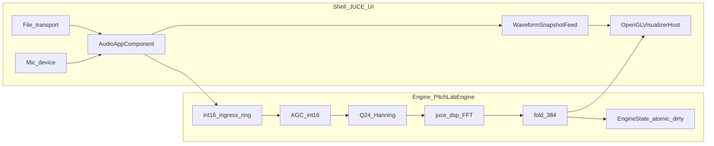

# Architecture

This repository follows the **Shell vs Engine** split described in the master roadmap: [My analysis/New Plan.md](../My%20analysis/New%20Plan.md).

## Shell (`Source/App/`)

The JUCE application is an **I/O host** only at the architectural level:

- Windowing, menus, file dialogs, transport UI (play / pause / seek).
- Audio device and routing: default output, file playback, microphone input.
- Feeding time-domain audio into the engine and presenting surfaces for visualization.

The Shell **must not** own music-theory logic, chromagram folding, FFT details, or fixed-point DSP policy. Keep that code in the engine.

## Engine (`Source/Engine/`)

The **PitchLabEngine** static library holds analysis and (later) rendering-oriented data structures that should be **unit-testable without launching the GUI**.

- Narrow public API: e.g. process blocks of samples, reset state, read results for drawing or for offline image export.
- Fidelity-sensitive code paths (integer ingress, Q24 windowing, AGC, etc.) live here per the roadmap—not in UI handlers.

## Test-driven development

- Prefer **small translation units** under `Source/Engine/` with tests in `Tests/`.
- Do **not** put FFT or block processing in button callbacks; the Shell calls into the Engine from the audio callback or a dedicated offline loop.

## Audio sources (future work)

Use one conceptual **audio source** in the Shell that delivers samples into the same Engine `process` path:

- **File + transport:** `AudioTransportSource` (or equivalent) so the visualizer always reflects what the transport is playing.
- **Microphone:** live input from `AudioDeviceManager`; switching file vs mic is a Shell concern only.

The Engine stays **agnostic** of whether samples came from disk or hardware.

## Realtime vs offline export (future work)

- **Realtime:** device/audio callback → Engine process → UI reads Engine state for visualization.
- **Offline:** decode or pull *n* seconds of audio without wall-clock pressure, run the same Engine process path deterministically, then snapshot a raster (e.g. waterfall chromagram) and encode to an image.

**Image format policy:** Prefer **JPEG** for large golden/reference outputs unless lossless comparison is required; otherwise **PNG** is acceptable. Document the choice in the feature that adds export.

## Forbidden moves (for agents and contributors)

- Do not **merge** `Source/App/` and `Source/Engine/` into a single unstructured folder.
- Do not **replace** fidelity-critical integer / fixed-point paths with “simpler” floating-point equivalents without an explicit, reviewed migration plan tied to the roadmap.
- Do not **edit** the vendored [JUCE/](../JUCE/) tree for product fixes; patch upstream or wrap in project code.
- Do not implement heavy DSP **inline in the UI**; keep the Engine testable.

## Data flow (current)

- **Audio thread:** `PitchLabEngine::processAudioInterleaved` runs ingress → analysis chain (AGC, Hanning Q24, real FFT magnitudes, 384-bin chroma fold). `EngineState::analysisDirty` is `std::atomic`; the GL thread clears it when a **waterfall row** is uploaded via `glTexSubImage2D`.
- **GL thread:** `OpenGLVisualizerHost` reads `WaveformSnapshotFeed` (short `CriticalSection` around a float snapshot) for the **Waveform** mode; **Waterfall** uses a 1024×384 R32F “film reel” with **dirty-row** uploads (384-wide subimage in the leftmost texels). The 12 vertical strips sample consecutive U segments across only that 384/1024 chroma portion, and the strip geometry is uploaded via a persistent `waterfallVbo_` with per-frame `glBufferSubData` (no per-frame buffer create/delete).
- **Visualization modes:** `VisualizationMode` enum — Waveform (live), Waterfall (chroma texture), Needle / Strobe / Chord matrix (stub renderers until further roadmap work).

## Phase 5 hooks (started)

- [PitchLabOptimizations.h](../Source/Engine/PitchLabOptimizations.h): integer RGB blend helper (§6.1).
- [PitchLabChord.h](../Source/Engine/PitchLabChord.h): placeholder for anti-chord penalty (§6.3).

## OpenGL / JUCE 8

OpenGL 3.2 is enabled for `TinyPitchHost`. If the GL child view is **black on Windows** (D2D interaction), see comments on `OpenGLVisualizerHost` and [New Plan.md](../My%20analysis/New%20Plan.md) §4.1 (heavyweight peer / D2D workarounds).

## Build and test (verification)

AI agents: use [AI_AGENT.md](AI_AGENT.md) for **build** and **test** commands during work.  
Humans / broken `build/` tree: [BUILD.md](BUILD.md); test framework notes: [TESTING.md](TESTING.md).
